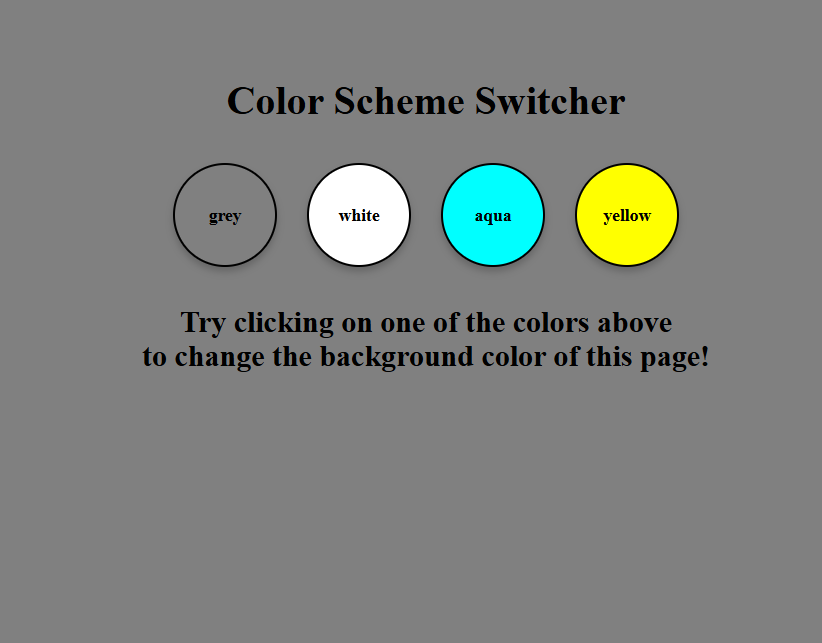

# Color Scheme Switcher

A simple project that demonstrates color scheme switching and interactive button functionality. This project is ideal for beginners learning HTML, CSS, and JavaScript.

## Features

- Four color buttons (`Grey`, `White`, `Blue`, and `Yellow`).
- Buttons change color and include a "push down" animation on click.
- Clicking the **Yellow** button changes the text color of all `<h1>` elements to white.

## Preview



## Technologies Used

- **HTML**: For the structure of the page.
- **CSS**: For styling the buttons and animations.
- **JavaScript**: For interactive functionality, such as changing text colors dynamically.

## Installation

1. Clone the repository:
   ```bash
   git clone https://github.com/Govind-github-tech/Colour_changing.git
   ```
2. Navigate to the project directory:
   ```bash
   cd color-scheme-switcher
   ```
3. Open the `index.html` file in your browser.

## Usage

Click on any button to see its "push down" animation.
<!-- 2. Click the **Yellow** button to change the text color of all `<h1>` elements to white. -->

## Code Structure

- **HTML**: Defines the buttons and text elements.
- **CSS**: Adds styling, including button colors and click animations.
- **JavaScript**: Implements the interactive behavior.

## Contribution

Contributions are welcome! Feel free to submit a pull request or open an issue.

<!-- ## License

This project is licensed under the [MIT License].

--- -->

**Enjoy experimenting with color schemes!**